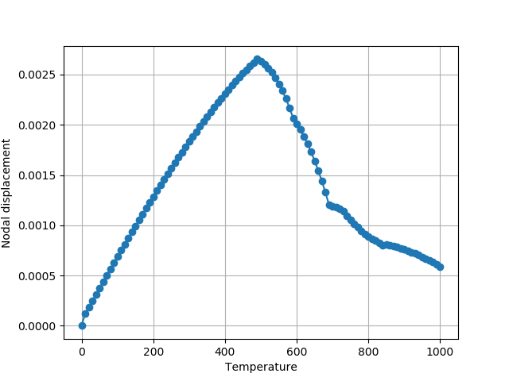

.. include:: sub.txt

=========================================
 Restrained beam under thermal expansion
=========================================

#. The original model can be found `here <https://www.wiki.ed.ac.uk/display/opensees/Restrained+beam+under+thermal+expansion>`_.

#. The Pypton source code is shown below, which can be downloaded :download:`here <beamThermal.py>`.

#. Change the line 2 below to set the right path where the OpenSeesPy library located.

#. Make sure the `numpy`_ and `matplotlib`_ packages are installed in your Python distribution.

#. Run the source code in your favorate Python program and should see

.. literalinclude:: beamThermal.py
   :linenos:
   :emphasize-lines: 2
