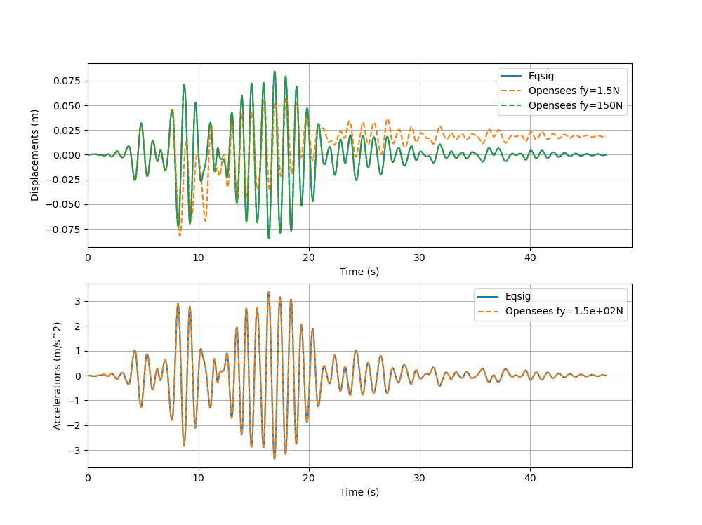

.. include:: sub.txt

==================================
Example name spaced nonlinear SDOF
==================================

#. The source code is shown below, which can be downloaded :download:`here <example_name_spaced_nonlinear_sdof.py>`.

#. Also download the constants file :download:`here <opensees_constants.py>`, and
the :download:`ground motion file <_static/test_motion_dt0p01.txt>`

#. Change the line 2 below to set the right path where the OpenSeesPy library located.

#. Make sure the `numpy`_, `matplotlib`_ and `eqsig`_ packages are installed in your Python distribution.

#. Run the source code in your favorite Python program and should see

.. literalinclude:: example_name_spaced_nonlinear_sdof.py
   :linenos:
   :emphasize-lines: 2
