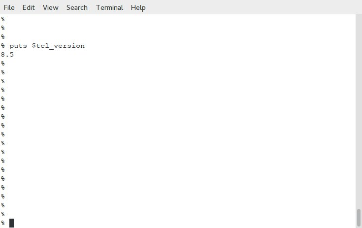
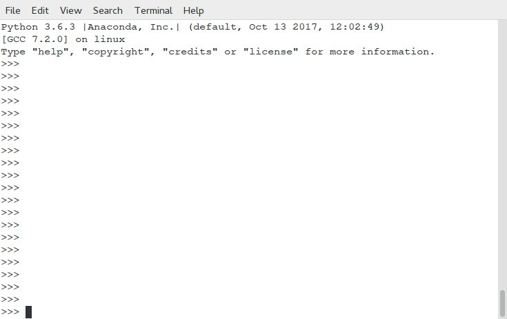
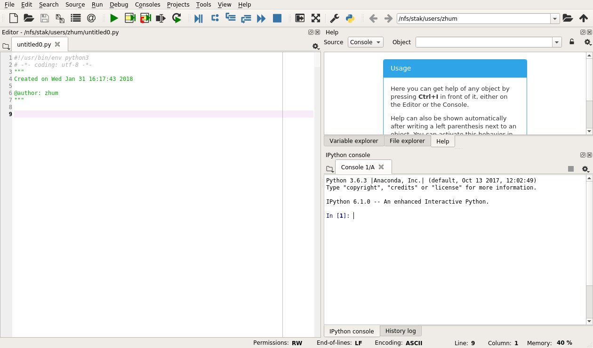

.. include:: sub.txt

================================
 Install OpenSeesPy in Linux:
================================

Install Tcl 8.5
------------------------------

Usually, the Tcl 8.5 is already installed in a Linux system.

Check the Tcl version

Install `Python 3.6 Linux`_ or `Anaconda 5.0 Linux`_
----------------------------------------------------

.. note::

   64bit Python 3.6 version is required!

Both work, but Anaconda comes with many libraries and editors

Check the python version

An anaconda environment

   
Download `OpenSeesPy Linux Library`_
------------------------------------

Two files, ``opensees.so`` and ``LICENSE.rst``, are included in the zip file.
Put the library file ``opensees.so`` in a directoy, which path should be copied
to

::

   sys.path.append('/path/to/OpenSeesPy')
