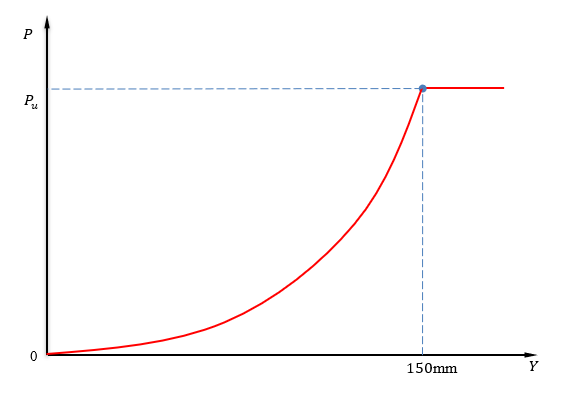

.. include:: sub.txt

======================
LiquefiedSand
======================

.. function:: hystereticBackbone('LiquefiedSand', backboneTag, X, D, kN, m)
   :noindex:

   The p-y curve model of liquefied sand is recommended 
    in Rollins (2005) based on the full-scale 
    lateral load tests to analyze the laterally 
    loaded single piles when the liquefied sand layer is present. 

   The backbone function is defined in `manual <https://www.pilegroups.com/single-post/p-y-curve-model-of-liquefied-sand-rollins-et-al-2005>`_

   ===================================   ===========================================================================
   ``backboneTag`` |int|                 integer tag identifying the backbone function.
   ``X`` |float|                         the depth.
   ``D`` |float|                         is the pile diameter 
   ``kN`` |float|                        Since the model assumes the metric units, 
                                         if your units are different 
                                         to, define kN to match your unit system.
   ``m`` |float|                         Define the unit meter for the same reason of kN
   ===================================   ===========================================================================

The typical p-y curve for liquefied sand is shown in the figure above. The pile lateral soil resistance, P, increases with the pile deflection along a concave upward curve until the deflection reaches 150 mm. Note that :math:`P_u` is the ultimate lateral resistance when the pile deflection (y value) is equal to or greater than 150 mm.

The following equations are proposed by Rollins et al. (2005) to estimate the mobilization of pile lateral soil resistance (P) with deflection (y):

.. math::
  P_{0.3m} = A(By)^C \leq 15 kN/m

  P_{d} = 3.81 \ln|D| + 5.6,\qquad \text{for } 0.3 m \lt D \lt 2.6 m

  P = P_{0.3m}P_d

  A = 3\times 10^{-7}(X+1)^{6.05}

  B = 2.8(X+1)^{0.11}

  C = 2.85(X+1)^{-0.41}

Note that A, B, and C in the equations above are the curve fitting parameters that depend on the depth (X). D is the pile diameter. :math:`P_d` is the pile diameter correction factor and it is limited to the pile diameter between 0.3 m and 2.6 m. 
