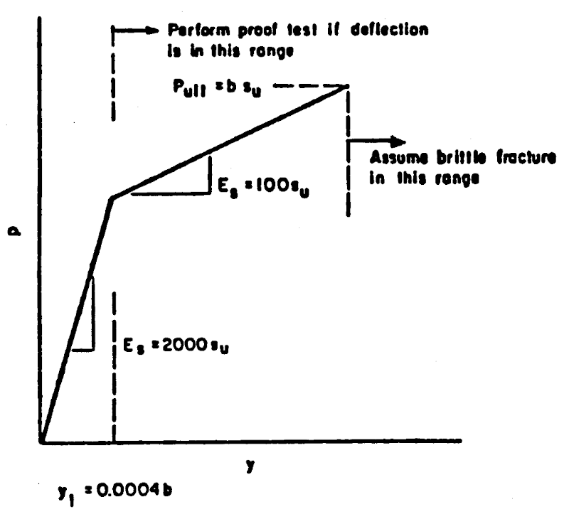

.. include:: sub.txt

======================
VuggyLimestone
======================

.. function:: hystereticBackbone('VuggyLimestone', backboneTag, b, su)
   :noindex:

   The backbone function is defined in this `manual <https://ntrl.ntis.gov/NTRL/dashboard/searchResults/titleDetail/PB94108305.xhtml>`_ in page 348

   ===================================   ===========================================================================
   ``backboneTag`` |int|                 integer tag identifying the backbone function.
   ``b`` |float|                         pile diameter
   ``su`` |float|                        shear strength of the rock
   ===================================   ===========================================================================

