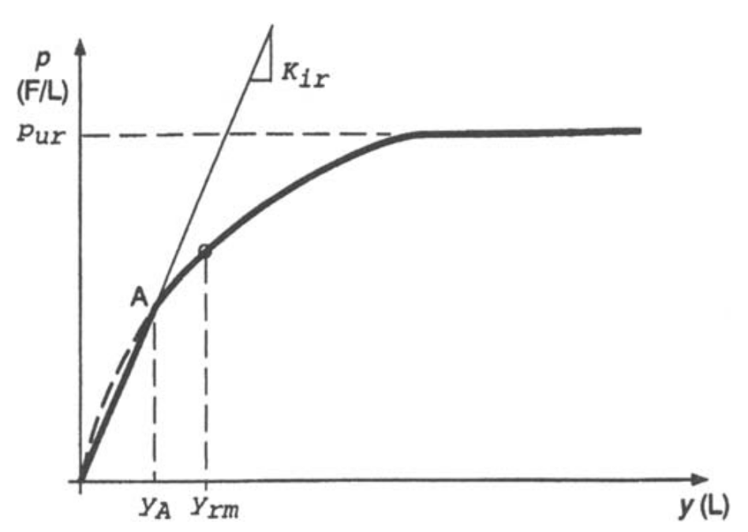

.. include:: sub.txt

======================
WeakRock
======================

.. function:: hystereticBackbone('WeakRock', backboneTag, Kir, pur, yrm)
   :noindex:

   The backbone function is defined on page 56 of this `manual <https://nap.nationalacademies.org/catalog/13975/rock-socketed-shafts-for-highway-structure-foundations>`_

   ===================================   ===========================================================================
   ``backboneTag`` |int|                 integer tag identifying the backbone function.
   ``Kir`` |float|                       see below
   ``pur`` |float|                       see below 
   ``yrm`` |float|                       see below
   ===================================   ===========================================================================

For "weak rock" defined as rock with unconfined compressive
strength between 0.5 MPa and 5 MPa, the shape of the p-y
curve, as shown in above Figure, can be described by the
following equations. For the initial linear portion of the
curve

.. math::
  p = K_{ir}y, \qquad \text{for  } y \leq y_A

For the transitional and nonlinear portion

.. math::
  p = \frac{p_{ur}}{2}\left(\frac{y}{y_{rm}}\right)^{0.25}, \qquad \text{for  } y \geq y_A, p \leq p_{ur}

and when the ultimate resistance is reached 

Kir
------

:math:`K_{ir}` is the initial slope of the curve, which is related
to the initial elastic modulus of the rock mass as follows

.. math::
  K_{ir} \approxeq k_{ir}E_{ir}

where :math:`E_{ir}` = rock mass initial elastic modulus and 
:math:`k_{ir}` = dimensionless constant given by 

.. math::
  k_{ir} = \left(100+\frac{400x_r}{3B}\right),\qquad \text{for  } 0 \leq x_r \leq 3B

  k_{ir} = 500, \qquad \text{for  } x_r \geq 3B

where :math:`B` is shaft diameter, :math:`x_r` is the depth below rock surface.

pur
------

:math:`p_{ur}` is the rock mass ultimate resistance defined as 

.. math::
  p_{ur} = \alpha_rq_uB\left(1+1.4\frac{x_r}{B}\right),\qquad \text{for  } 0 \leq x_r \leq 3B
  
  p_{ur} = 5.2\alpha_rq_uB, \qquad \text{for  } x_r \geq 3B

in which :math:`q_u` = uniaxial compressive strength of intact rock,
:math:`\alpha_r` = strength reduction factor, 
and :math:`x_r` = depth below rock
surface. Selection of :math:`\alpha_r`
is based on the assumption that fracturing will occur at the surface of 
the rock under small deflections, thus reducing the rock mass compressive strength. 
The
value of :math:`\alpha_r` is assumed to be one-third for RQD of 100 and to
increase linearly to unity at RQD of zero. The underlying 
assumption is that, if the rock mass is already highly fractured,
then no additional fracturing with accompanying strength
loss will occur. However, this approach appears to have a
fundamental shortcoming in that it relies on the compressive
strength of the intact rock and not the strength of the rock
mass. For a highly fractured rock mass (low RQD) with a
high-intact rock strength, it seems that the rock mass strength
could be overestimated.

yrm
------

.. math::
  y_{rm} = k_{rm} B

where 

:math:`k_{rm}` is a constant ranging from 0.0005 to 0.00005 that serves
to establish the overall stiffness of the curve.

:math:`B` is the shaft diameter.