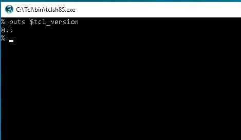
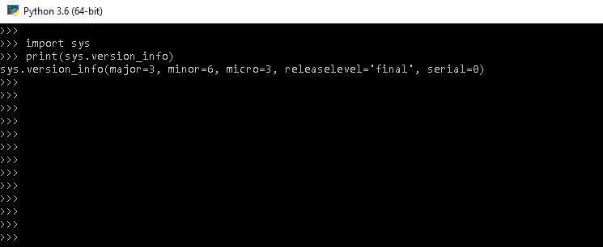
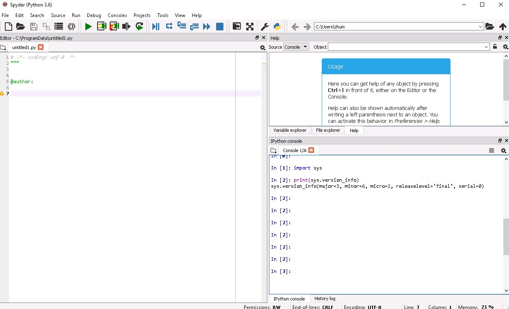

.. include:: sub.txt

================================
 Install OpenSeesPy in Windows:
================================

Install `ActiveStateTcl 8.5`_
------------------------------

Check the Tcl version

Install `Python 3.6`_ or `Anaconda 5.0 Windows`_
------------------------------------------------

Both work, but Anaconda comes with many libraries and editors

Check the python version

An anaconda environment

   
Download `OpenSeesPy Windows Library`_
--------------------------------------

Two files, ``opensees.pyd`` and ``LICENSE.rst``, are included in the zip file.
Put the library file ``opensees.pyd`` in a directoy, which path should be copied
to

::

   sys.path.append('C:/path/to/OpenSeesPy')
